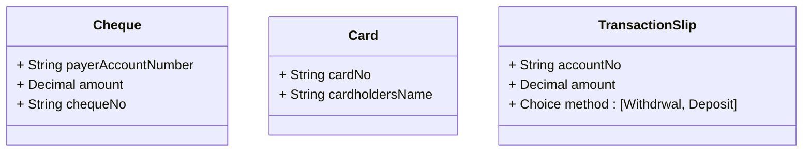
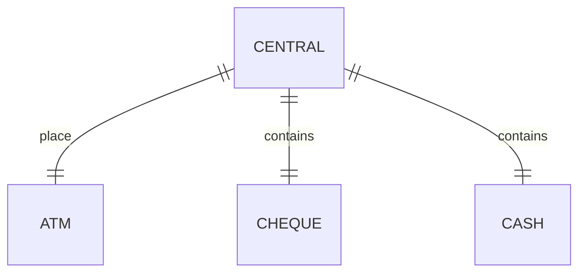

###### Computer Networks Laboratory  
# CSS652 Lab Final Assignment - Bank Transactions

1. Initialize the database first by 
```bash
python init.py
```
2. Start server
```bash
python server.py
```
3. Run (multiple) client application
```bash
python client.py
```
<hr>

The central server on port `3000` redirects communication with
<table>
  <tbody>
    <tr>
      <td>Cheque Managing Server</td>
      <td>3001</td>
    </tr>
    <tr>
      <td>ATM Managing Server</td>
      <td>3002</td>
    </tr>
    <tr>
      <td>Cash Servers</td>
      <td>3003</td>
    </tr>
  </tbody>
</table> 

### <u>Cheque Managing Server</u>
Cheque is used to transfer money to other account. When a cheque is issued by a client, it makes an entry in the `issued_cheques` table. That cheque can be claimed by any person having an account. 

### <u>ATM Managing Server</u>
Withdraws the amount directly from account of Card Number. 


### <u>Cash Server</u>
A transaction can be processed with account no 



